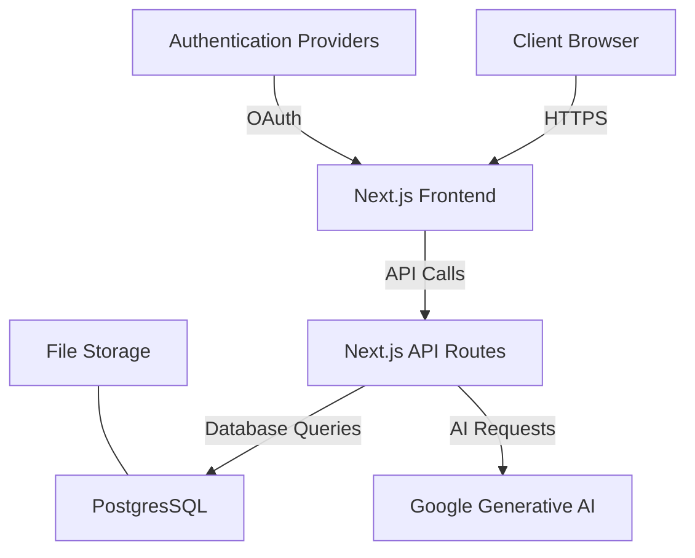

# RFP Application Architecture and API Design

## 1. Overall System Architecture

The RFP Application will follow a modern, scalable architecture leveraging Next.js, PostgresSQL, and Google Generative AI. Here's an overview of the system components:

### Components:

1. **Next.js Frontend**: Server-side rendered React application
2. **Next.js API Routes**: Serverless functions for backend logic
3. **PostgresSQL**: Database and authentication system
4. **Google Generative AI**: AI service for natural language processing tasks
5. **Authentication Providers**: Email, Microsoft SSO, Google SSO
6. **File Storage**: For storing RFP documents and attachments

## 2. API Structure

The API will be implemented using Next.js API routes. Here's a proposed structure for the API endpoints:

### Authentication

- `POST /api/auth/login`: User login
- `POST /api/auth/register`: User registration
- `POST /api/auth/logout`: User logout
- `GET /api/auth/me`: Get current user information

### Organizations

- `GET /api/organizations`: List organizations (companies, sub-companies, departments)
- `POST /api/organizations`: Create new organization
- `GET /api/organizations/:id`: Get organization details
- `PUT /api/organizations/:id`: Update organization
- `DELETE /api/organizations/:id`: Delete organization

### Users

- `GET /api/users`: List users (with filtering options)
- `POST /api/users`: Create new user
- `GET /api/users/:id`: Get user details
- `PUT /api/users/:id`: Update user
- `DELETE /api/users/:id`: Delete user
- `PUT /api/users/:id/roles`: Update user roles
- `PUT /api/users/:id/voting-rights`: Update user voting rights

### RFPs

- `GET /api/rfps`: List RFPs (with filtering options)
- `POST /api/rfps`: Create new RFP
- `GET /api/rfps/:id`: Get RFP details
- `PUT /api/rfps/:id`: Update RFP
- `DELETE /api/rfps/:id`: Delete RFP
- `POST /api/rfps/:id/files`: Upload files to RFP
- `DELETE /api/rfps/:id/files/:fileId`: Delete file from RFP
- `POST /api/rfps/:id/process`: Trigger AI processing of RFP
- `GET /api/rfps/:id/summary`: Get AI-generated summary of RFP
- `POST /api/rfps/:id/questions`: Add question to RFP
- `PUT /api/rfps/:id/questions/:questionId`: Update question
- `DELETE /api/rfps/:id/questions/:questionId`: Delete question
- `POST /api/rfps/:id/comments`: Add comment to RFP
- `PUT /api/rfps/:id/comments/:commentId`: Update comment
- `DELETE /api/rfps/:id/comments/:commentId`: Delete comment

### Voting

- `POST /api/rfps/:id/voting`: Start voting for RFP
- `PUT /api/rfps/:id/voting`: Update voting status
- `POST /api/rfps/:id/votes`: Submit vote for RFP
- `GET /api/rfps/:id/votes`: Get voting results for RFP

### AI Integration

- `POST /api/ai/analyze`: Analyze text using AI
- `POST /api/ai/generate-summary`: Generate summary using AI
- `POST /api/ai/answer-question`: Answer question using AI

### Billing

- `GET /api/billing`: Get billing information
- `PUT /api/billing`: Update billing information
- `GET /api/billing/usage`: Get usage statistics
- `GET /api/billing/invoices`: Get invoices

### Notifications

- `GET /api/notifications`: Get user notifications
- `PUT /api/notifications/:id`: Mark notification as read
- `PUT /api/notifications/settings`: Update notification preferences

### Search

- `GET /api/search`: Global search endpoint

### Reports

- `GET /api/reports/usage`: Get usage reports
- `GET /api/reports/performance`: Get performance reports

This API structure covers the main functionalities of the RFP application as described in the project documents. It provides endpoints for managing organizations, users, RFPs, voting, AI integration, billing, notifications, search, and reporting.

The actual implementation of these endpoints will be done using Next.js API routes, which will interact with PostgresSQL for data storage and retrieval, and with Google Generative AI for AI-powered features.

Remember to implement proper authentication and authorization checks for each endpoint to ensure data security and access control based on user roles and permissions.